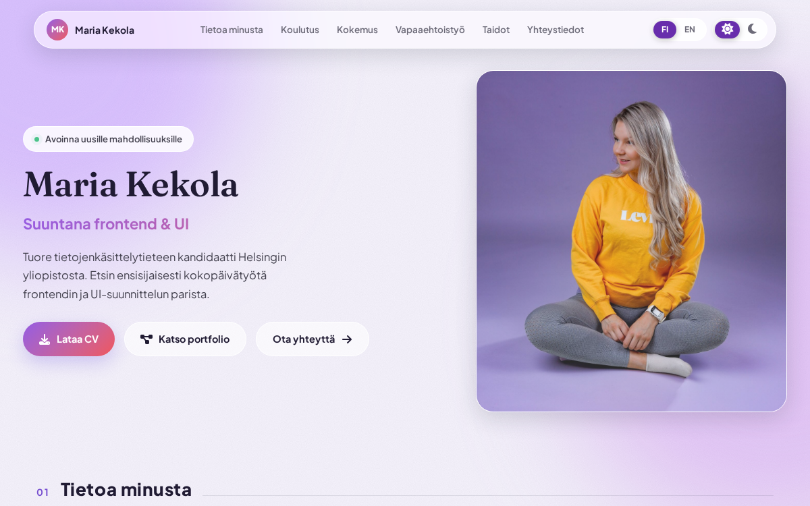
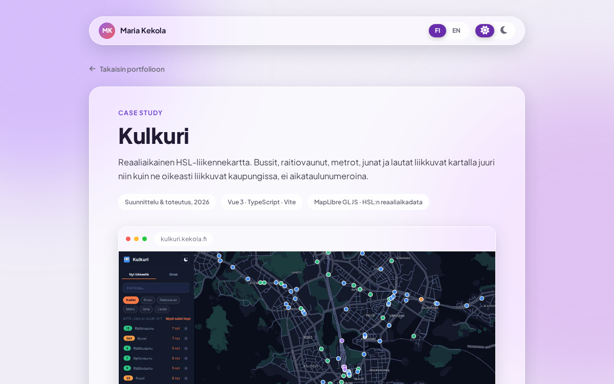
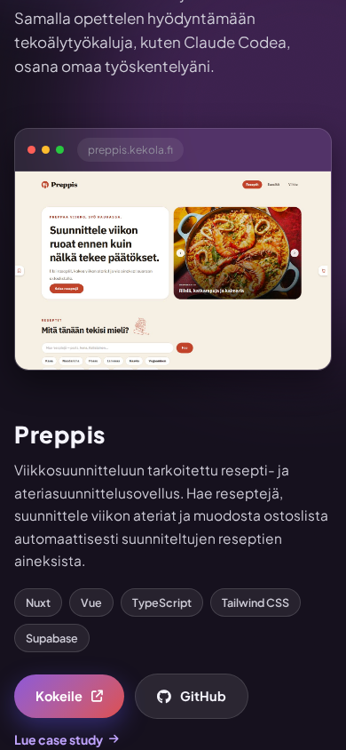
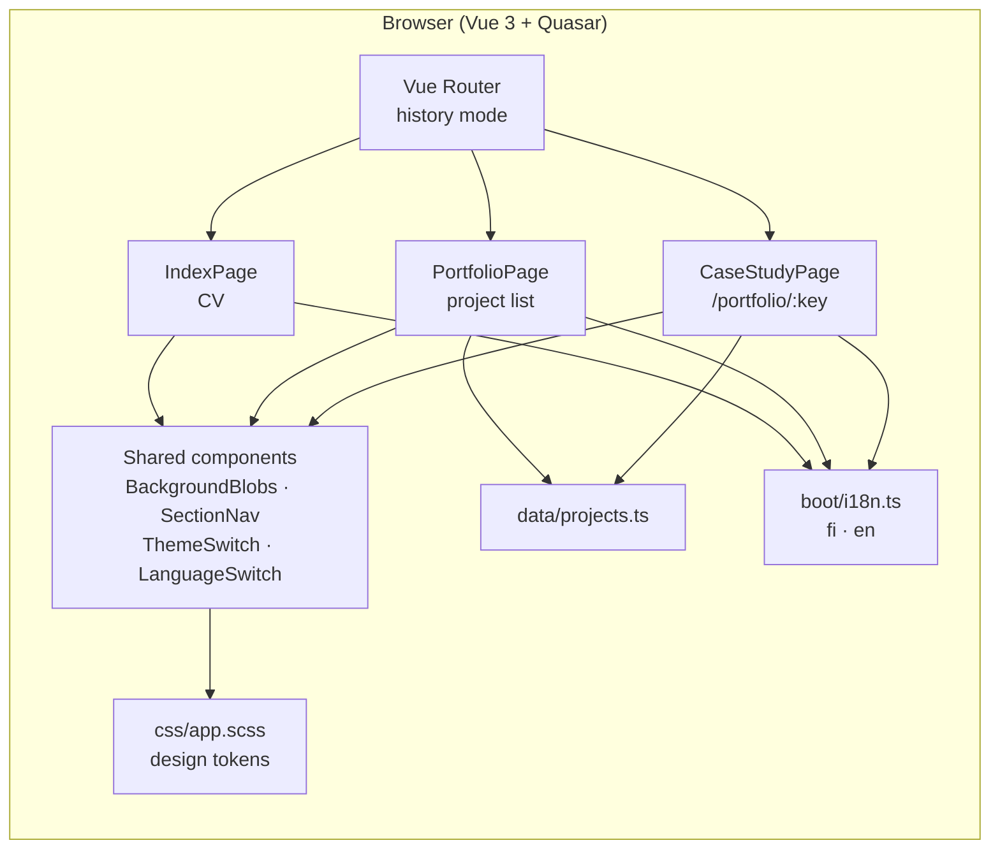

# Kekola.fi 😸

[Suomeksi](README.md) · **English**

**Kekola.fi: a CV and portfolio, designed and coded from scratch.**

Kekola.fi is a personal CV and portfolio site. It covers work experience, education and skills, and every project in the portfolio has its own case study page describing the problems that came up along the way and how they were solved. The whole site is bilingual and works in both a light and a dark theme. The visual language is built on glass surfaces and an aurora gradient, and every colour is defined as a design token in one place.

**[See the site here →](https://kekola.fi)**

## Screenshots

| Home                                                    | Case study                                              | Mobile, dark theme                                         |
| ------------------------------------------------------- | ------------------------------------------------------- | ---------------------------------------------------------- |
|  |  |  |

## Features

- CV page with an introduction, work experience, education, volunteer work, skills and contact details
- Portfolio page listing the projects, each with its own case study page at `/portfolio/:project`
- Finnish and English, switchable on the fly with Vue I18n, and the downloadable CV follows the chosen language
- Light and dark theme, each with its own values for the same tokens
- The timeline draws itself once when it scrolls into view, and the current job keeps pulsing
- Background colour blobs drift with the pointer at different speeds, giving the glass surfaces a sense of depth
- Case study pages carry a thin progress bar showing how far into the text the reader is
- All motion turns off when the operating system has `prefers-reduced-motion` enabled, and the pointer effect is skipped on touch devices
- Moving from the portfolio into a case study and back restores the scroll position you came from
- Printable version: a dedicated print stylesheet that forces a light, readable layout regardless of the theme
- CV downloadable as a PDF in both Finnish and English

## Tech

- [Vue 3](https://vuejs.org/) + TypeScript
- [Quasar](https://quasar.dev/) (Vite based)
- [Vue Router](https://router.vuejs.org/) in history mode
- [Vue I18n](https://vue-i18n.intlify.dev/) for the two languages
- SCSS and CSS custom properties, colours in the `oklch()` colour space
- [Plus Jakarta Sans](https://fonts.google.com/specimen/Plus+Jakarta+Sans) and [Fraunces](https://fonts.google.com/specimen/Fraunces) from Google Fonts, loaded without blocking rendering
- [Font Awesome](https://fontawesome.com/) subsetted, so only the icons actually used are bundled
- Netlify for hosting

## Architecture



Content and presentation are kept apart, so editing copy or projects does not mean touching components:

- `src/pages/`: `IndexPage.vue` (CV), `PortfolioPage.vue` (project list) and `CaseStudyPage.vue`, a single generic page serving every case study and reading its content from the route parameter
- `src/components/`: shared pieces such as `BackgroundBlobs.vue` (background gradients and pointer parallax), `ThemeSwitch.vue`, `LanguageSwitch.vue`, `SectionNav.vue`
- `src/data/projects.ts`: project metadata in one place, meaning links, images, tech tags and whether a project has a case study
- `src/boot/i18n.ts`: all copy in both languages, including the case study content
- `src/css/app.scss`: design tokens as CSS custom properties, defined separately for the light and dark themes

The site tokens are also documented as a Figma style library, where the same colours, typography and shadows live as variables and styles.

## Getting started

Install the dependencies:

```bash
npm install
```

Start the development server:

```bash
npm run dev
```

The app is then available at `http://localhost:9000`.

### Linting and formatting

```bash
npm run lint      # ESLint
npm run format    # Prettier
```

### Build for production

```bash
npm run build
```

## Deployment

The site runs on Netlify and is built from the `master` branch. Routing is in history mode, so Netlify is configured to fall back to `index.html`, which keeps direct links to case study pages working.
