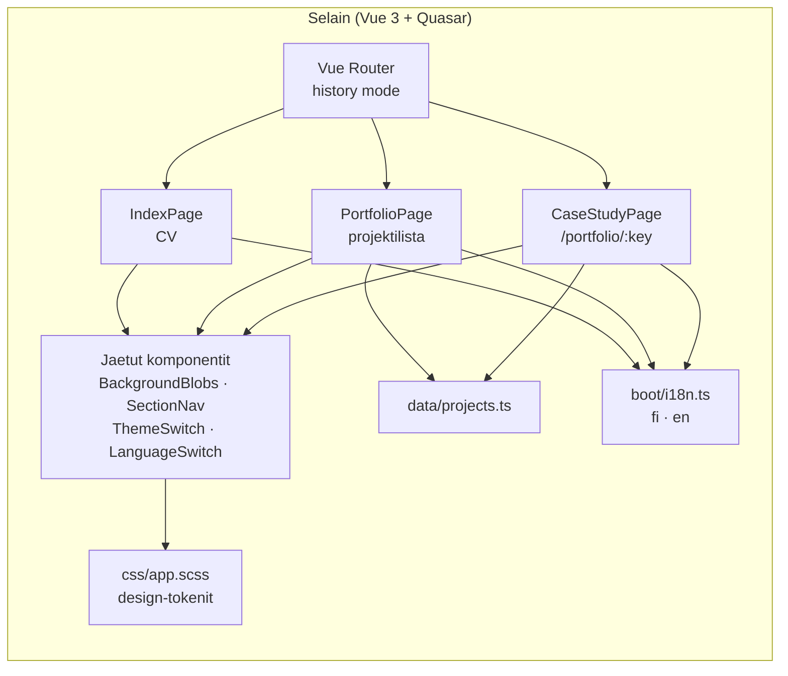

# Kekola.fi 😸

**Suomeksi** · [English](README.en.md)

**Kekola.fi: CV ja portfolio.**

Kekola.fi on henkilökohtainen CV- ja portfoliosivusto. Sivusto esittelee työkokemuksen, koulutuksen ja taidot, ja portfolio-osiossa jokaisesta projektista on oma case study -sivunsa, jossa kerrotaan mitä ongelmia matkan varrella tuli vastaan ja miten ne ratkaistiin. Koko sivusto on kaksikielinen ja toimii sekä vaalealla että tummalla teemalla. Visuaalinen ilme perustuu lasimaisiin pintoihin ja aurora-gradienttiin, ja kaikki värit on määritelty design-tokeneina yhdessä paikassa.

**[Katso sivusto täällä →](https://kekola.fi)**

## Kuvakaappaukset

| Etusivu                                                 | Case study                                              | Mobiili, tumma teema                                       |
| ------------------------------------------------------- | ------------------------------------------------------- | ---------------------------------------------------------- |
|  |  |  |

## Ominaisuudet

- CV-sivu, jossa esittely, työkokemus, koulutus, vapaaehtoistyö, taidot ja yhteystiedot
- Portfolio-sivu projekteista, ja jokaiselle projektille oma case study -sivunsa osoitteessa `/portfolio/:projekti`
- Suomi ja englanti, vaihdettavissa lennossa Vue I18n:llä, myös ladattava CV vaihtuu kielen mukaan
- Vaalea ja tumma teema, molemmille omat värinsä samoille tokeneille
- Aikajana piirtyy kerran kun se tulee näkyviin, ja nykyinen työpaikka jää sykkimään
- Taustan väripallot seuraavat hiirtä eri nopeuksilla, mikä tuo lasipinnan taakse syvyyttä
- Case study -sivuilla ohut lukupalkki, joka kertoo kuinka pitkällä lukija on
- Kaikki liike kytkeytyy pois jos käyttöjärjestelmässä on `prefers-reduced-motion` päällä, ja hiiriefekti jää pois kosketusnäytöiltä
- Portfoliosta case studyyn ja takaisin siirryttäessä selaus palaa siihen kohtaan jossa olit
- Tulostettava versio: oma tulostustyyli, joka pakottaa vaalean ja luettavan ulkoasun teemasta riippumatta
- Ladattava CV PDF:nä suomeksi ja englanniksi

## Teknologiat

- [Vue 3](https://vuejs.org/) + TypeScript
- [Quasar](https://quasar.dev/) (Vite-pohjainen)
- [Vue Router](https://router.vuejs.org/) history-moodissa
- [Vue I18n](https://vue-i18n.intlify.dev/) kaksikielisyyteen
- SCSS ja CSS-muuttujat, värit `oklch()`-väriavaruudessa
- [Plus Jakarta Sans](https://fonts.google.com/specimen/Plus+Jakarta+Sans) ja [Fraunces](https://fonts.google.com/specimen/Fraunces) Google Fontsista, ladattuna renderöintiä estämättä
- [Font Awesome](https://fontawesome.com/) subsetattuna, eli mukaan paketoidaan vain käytetyt ikonit
- Netlify hostaukseen

## Arkkitehtuuri



Sisältö ja ulkoasu on pidetty erillään, jotta tekstien ja projektien muokkaaminen ei vaadi komponenttien koskemista:

- `src/pages/`: `IndexPage.vue` (CV), `PortfolioPage.vue` (projektilista) ja `CaseStudyPage.vue`, joka on yksi geneerinen sivu kaikille case studyille ja lukee sisältönsä reitin parametrin perusteella
- `src/components/`: jaetut osat, esimerkiksi `BackgroundBlobs.vue` (taustan gradientit ja hiiriparallaksi), `ThemeSwitch.vue`, `LanguageSwitch.vue`, `SectionNav.vue`
- `src/data/projects.ts`: projektien metatiedot yhdessä paikassa, eli osoitteet, kuvat, teknologiatagit ja tieto siitä onko projektilla case study
- `src/boot/i18n.ts`: kaikki tekstit molemmilla kielillä, myös case studyjen sisältö
- `src/css/app.scss`: design-tokenit CSS-muuttujina, erikseen vaalealle ja tummalle teemalle

Sivuston tokenit on dokumentoitu myös Figma-tyylikirjaksi, jossa samat värit, typografia ja varjot ovat muuttujina ja tyyleinä.

## Käyttöönotto

Asenna riippuvuudet:

```bash
npm install
```

Käynnistä kehityspalvelin:

```bash
npm run dev
```

Sovellus on nyt käytettävissä osoitteessa `http://localhost:9000`.

### Testaus ja koodin laatu

```bash
npm run lint      # ESLint
npm run format    # Prettier
```

### Tuotantoversion kääntäminen

```bash
npm run build
```

## Julkaisu

Sivusto on Netlifyssä ja rakennetaan `master`-haarasta. Reititys on history-moodissa, joten Netlifylle on määritelty uudelleenohjaus `index.html`:ään, jotta suorat linkit case study -sivuille toimivat.
